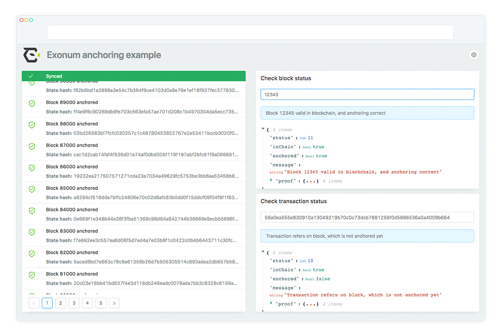

# Exonum Anchoring Client Example
[![js-standard-style][codestyle-image]][codestyle-url]
[![License][license-image]][license-url]

[codestyle-image]: https://img.shields.io/badge/code%20style-standard-brightgreen.svg
[codestyle-url]: http://standardjs.com
[license-image]: https://img.shields.io/github/license/exonum/exonum-client.svg?style=flat-square
[license-url]: https://opensource.org/licenses/Apache-2.0

Example application for [exonum-client-anchoring](https://github.com/exonum/exonum-client-anchoring).


This example demonstrate initialization and basic usage.
* [Initialization](https://github.com/exonum/anchoring-client-example/blob/master/src/sagas/initializeCheck.saga.js#L33)
* [Event handling](https://github.com/exonum/anchoring-client-example/blob/master/src/sagas/exonumAnchoring.saga.js)
* [Transaction Status](https://github.com/exonum/anchoring-client-example/blob/master/src/sagas/txStatus.saga.js)
* [Block Status](https://github.com/exonum/anchoring-client-example/blob/master/src/sagas/blockStatus.saga.js)

## How to run
First, install dependencies:
```sh
npm i
```
Then, start application:
```sh
npm run start
```

## LICENSE

Exonum Anchoring Client Example is licensed under the Apache License (Version 2.0).
See [LICENSE](https://github.com/exonum/blockchain-explorer/blob/master/LICENSE) for details.
